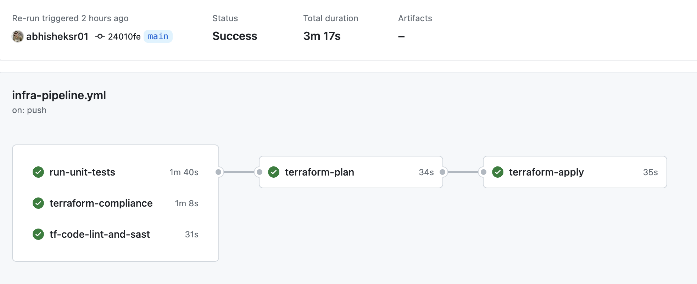
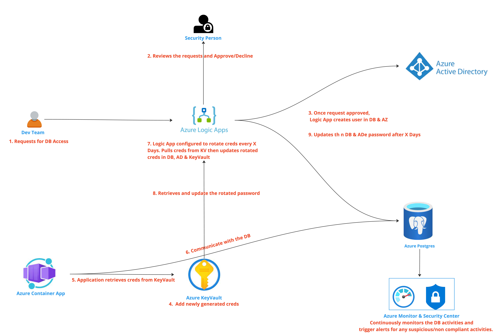

# Python Postgres Azure Flask Application

This repository contains solutions to two distinct tasks:

1. A Python Flask API deploying to Production Environment
2. Secure Database Access from the API

The codebase can be better visualized as below:


   
# Table of Content

- [Python Postgres Azure Flask Application](#python-postgres-azure-flask-application)
- [Table of Content](#table-of-content)
- [Python Flask API](#python-flask-api)
  - [Premise](#premise)
  - [Prerequisite and Tools Used](#prerequisite-and-tools-used)
    - [Development](#development)
    - [DevSecOps Toolings](#devsecops-toolings)
  - [Running the API Service and DB locally](#running-the-api-service-and-db-locally)
  - [Infrastructure as Code](#infrastructure-as-code)
    - [Bootstrap Infrastructure - `/infrastructure/bootstrap`:](#bootstrap-infrastructure---infrastructurebootstrap)
      - [**Chicken and Egg Paradox**](#chicken-and-egg-paradox)
    - [Application-Infrastructure `/infrastructure/app-infra`:](#application-infrastructure-infrastructureapp-infra)
  - [CI/CD - Github Actions](#cicd---github-actions)
- [Theoretical Case: Secure Database Access](#theoretical-case-secure-database-access)
    - [Secure Access Requirements:](#secure-access-requirements)
    - [Solution](#solution)
- [Assumptions](#assumptions)
- [ToDo](#todo)
  - [Documentation](#documentation)
  - [App Code](#app-code)
  - [IAC](#iac)
  - [CI/CD](#cicd)
  - [Networking/Security](#networkingsecurity)

# Python Flask API
## Premise

In this section, we will cover a practical solution for setting up a deployable production environment for a simplified application. This environment consists of a API service deployed on Azure Cloud. The goal is to automate the setup of this production environment using "infrastructure as code" principles. Below are the steps to achieve this:

## Prerequisite and Tools Used

> Note: The solution development was conducted on a MacBook M1. Therefore, the instructions are tailored for use in a macOS environment or a similar development environment.

Before we get started ensure you have below tools setup:
### Development

- *Python v3.11* - For developing the Flask API application.
- *Terraform v1.5.7* - Leading Infrastructure as Code framework for building Cloud & On-Prem Infrastructure.
- *GoLang go v1.21.1 (Optional)* - We are using `Terratest` for testing our TF Code. So only if you wish to write or run tests then you would require it.
- *Docker Desktop* - Used for containerizing and testing the application locally.
- *Azure Cloud Account (Optional)* - For deploying the application to the Cloud Environment.
- *Azure Container Apps* - A fully managed serverless containerized application platform. We are deploying our API service to it.
- *Github Account (Free Tier)* - If you would like to fork this repo and run the pipeline.
- *Github Actions* - Our CI/CD platform providing a cloud agnostic approach for application and infrastructure deployment.
- *DockerHub* - For storing our private docker image. SaaS solution quick to use. Ideally for a enterprise solution we need a Paid tier of DockerHub or use other solutions such Azure Container Registry etc.
- *Behave* - For BDD testing using the Gherkins Syntax of the API.

### DevSecOps Toolings

All the tools we have used so far are Free to use for personal usage.

- *TFSec* - Scans Terraform Code for vulnerable configurations.
- *TFLint* - Linting the TF Code
- *Terraform-Compliance* - Lightweight, security and compliance focused test framework.
- *Terratest* - For Unit Testing the IAC and ensuring the configuration matches the desired state.
- *Bandit* - A python lib for static code analysis.
- *Safety* - A python lib for dependency vulnerability analysis.
- *Checkov* - IAC vulnerability scanning tool, we have used it for scanning our Dockerfile.
- *trivy* - For scanning vulnerabilities in docker image even before pushing it to the registry. 
- *Owasp Zap* - PenTest
- Github Secret Scanning
- *Dependabot and Mergify* - Dependabot bumps the dependencies by creating a PR. This helps us keep our dependencies up to date and avoid vulnerabilities. We also use Mergify to streamline the PR merging process, automating it when all the necessary checks and criteria are satisfied.
## Running the API Service and DB locally
1. Start Docker Desktop
2. From the root directory of this repository execute below command:
    ```bash
    make start-app-db
    ```
    The above command uses docker compose to run containerized instance of our API and `postgres-13.5` database and then uploads the mock data into the postgres database.

3. Test the application by making API requests. For example:
   - GET - Greeting API (Health check)
      ```bash
      curl http://127.0.0.1:3000
      ```

      ```json
      {"message":"Hello world!"}
      ```
   - GET - Rates API
      ```bash
      curl "http://127.0.0.1:3000/rates?date_from=2021-01-01&date_to=2021-01-31&orig_code=CNGGZ&dest_code=EETLL"
      ```

      The output should be something like this:
       ```json
       {
          "rates" : [
             {
                "count" : 3,
                "day" : "2021-01-31",
                "price" : 1154.33333333333
             },
             {
                "count" : 3,
                "day" : "2021-01-30",
                "price" : 1154.33333333333
             },
             ...
          ]
       }
       ```
4. Stop the application
   ```bash
   make stop-app-db
   ```
5. Check all available options
   ```bash
   make help
   ```
    </details>
    <details>
    <summary>Click here to check the local execution steps</summary>
    
    #### Running the database

    There’s an SQL dump in `db/rates.sql` that needs to be loaded into a PostgreSQL 13.5 database.
    
    After installing the database, the data can be imported through:
    
    ```bash
    createdb rates
    psql -h localhost -U postgres < db/rates.sql
    ```
    
    You can verify that the database is running through:
    
    ```bash
    psql -h localhost -U postgres -c "SELECT 'alive'"
    ```
    
    The output should be something like:
    
    ```bash
     ?column?
    ----------
     alive
    (1 row)
    ```
    
    #### Running the API service
    
    Start from the `rates` folder.
    
    ##### Install prerequisites
    
    ```
    DEBIAN_FRONTEND=noninteractive apt-get update && apt-get install -y python3-pip
    pip install -U gunicorn
    pip3 install -Ur requirements.txt
    ```
    
    ##### Run the application
    ```
    gunicorn -b :3000 wsgi
    ```
    
    The API should now be running on [http://localhost:3000](http://localhost:3000).
    
    ##### Test the application
    
    Get average rates between ports:
    ```
    curl "http://127.0.0.1:3000/rates?date_from=2021-01-01&date_to=2021-01-31&orig_code=CNGGZ&dest_code=EETLL"
    ```
    
    The output should be something like this:
    ```json
    {
       "rates" : [
          {
             "count" : 3,
             "day" : "2021-01-31",
             "price" : 1154.33333333333
          },
          {
             "count" : 3,
             "day" : "2021-01-30",
             "price" : 1154.33333333333
          },
          ...
       ]
    }
    ```
    </details>

## Infrastructure as Code
The solution uses Terraform (infrastructure as code components) that allow you to deploy this environment on cloud providers such as Azure.


We have 2 logical segregation of the terraform code as below:

### Bootstrap Infrastructure - `/infrastructure/bootstrap`:

Bootstrap Infrastructure refers to the essential infrastructure resources that are necessary during the initial provisioning phase and ideally remains unchanged or require infrequent modifications.

Contains terraform code for provisioning Resource Group, Storage account, Service  Principal etc.

These kind of infrastructure requires higher level of privileges for provisioning and in some organization it's maintained by a separate team (Cloud Engineering, SRE etc) for various purposes.

<details>
<summary>Click here to see implementation details</summary>

#### **Chicken and Egg Paradox**

Building infrastructure from scratch poses a "Chicken and Egg Paradox" challenge.
This challenge arises because, for Terraform to store its state, a storage container is required. We may choose to provision this storage container manually.
However, as per our commitment to provisioning all resources through Infrastructure as Code (IAC), we encounter a problem. We can deal with this problem as below:

- Initialize Terraform without a "remote backend."
- Write bare minimal Terraform code for provisioning a storage container.
- Apply Terraform changes to create this storage container successfully.
- After the container is provisioned, the Terraform backend configuration is added to the Terraform provider.Subsequently, Terraform is reinitialized.
- Now, the backend provisioning is managed by Terraform itself, ensuring ease of management.

Follow below steps for provisioning bootstrap infrastructure:

- Ensure you have Terraform `1.5.7` installed

   ```bash
   terraform --version
   ```

- Authenticate Azure CLI by running below command from the terminal (or other appropriate means)

   ```bash
   az login
   ```

- From the terminal change the directory
   ```bash
   cd infrastructure/bootstrap
   ```
- Comment terraform backend config `backend "azurerm" {}` is commented in `infrastructure\bootstrap\main.tf`

- Initialize Terraform for dev environment
   ```bash
   terraform init -var-file=./dev/terraform.tfvars
   ```

- Plan the Terraform changes and review
   ```bash
   terraform plan -var-file=./dev/terraform.tfvars
   ```

- Apply changes after its reviewed
   ```bash
   terraform init -var-file=./dev/terraform.tfvars
   ```
- Re Initialize Terraform to use a remote backend

   Uncomment `# backend "azurerm" {}`

   Then execute below command and when prompted respond as `yes`:

   ```bash
   terraform init -backend-config=./dev/backend-config.hcl -var-file=./dev/terraform.tfvars
   ```
   Once successfully executed the local `terraform.state` file has been securely  stored in the Azure Storage Account.

- Repeat the steps for other environments.

We have configured a `bootstrap-infrastructure` Github Actions Pipeline to automate the bootstrap infrastructure provisioning and avoid any local execution apart from the initial setup [here](.github/workflows/infra-pipeline.yml)
  
</details>

### Application-Infrastructure `/infrastructure/app-infra`:

Contains terraform code for provisioning Azure VNet, VNet associated infrastructure components and Azure Container Apps for deploying a simple containerized application.

Application infrastructure refers to any infrastructure that we will use for deploying and running the application. They are intended for the team who owns the application and generally requires very specific privileges for the infrastructure deployment.

<details>
<summary> Click here to see the implementation details</summary></br>

The application infrastructure primarily contains the Terraform code for deploying the Python Flask API and the Database connection configurations can be managed by the terraform code defined in the `terraform.tfvars` in the respective environment directory.

Override the default values set in the `variables.tf` for each environment in the `[ENVIRONMENT_NAME]/terraform.tfvars` file respectively as shown below:

```terraform
app_container_config={
    name          = "[ENVIRONMENT_NAME]-python-postgres-azure-app"
    revision_mode = "Single"
    memory        = "0.5Gi"
    cpu           = 0.25
    ingress = {
      allow_insecure_connections = false
      external_enabled           = true
      target_port                = 5000
    }
    environment_variables = [
      {
        name  = "name"
        value = "[ENVIRONMENT_NAME]postgres"
      },
      {
        name  = "user"
        value = "[ENVIRONMENT_NAME]abhishek"
      },
      {
        name  = "host"
        value = "[POSTGRES_HOST_URL_FOR_RESPECTIVE_ENVIRONMENT]"
      }
    ]
  }
```

   These infrastructure changes are deployed as part of the `python-application-deployment` Github Actions Pipeline configure [here](.github/workflows/app-pipeline.yml)
</details>

## CI/CD - Github Actions
We use Github Actions for automating below operations:
- Provisioning our Azure Infrastructure in all the environments with all the quality and security gates
- Deploying the Python Flask API in all the environments with all the quality and security gates
- Testing Dependabot and other PR's and automatically merging once all the success criteria are met
- Scheduled Vulnerability Scanning of all the components of the SDLC and Infrastructure
- Scheduled Smoke Test on Infrastructure for any drift detection

We are using `Github-OIDC` for securing the connectivity between the Github Actions and Azure Cloud thus reducing the risk of compromising the credentials. Once the service principal is provisioned by the bootstrap infrastructure you must configure them in the github repository under `Settings > Secrets and Variables > Actions > New Repository Secret`


Python Application Pipeline:


Infrastructure Pipeline:


# Theoretical Case: Secure Database Access

### Secure Access Requirements:
Secure Access to the Postgres Database deployed on Azure Cloud requires:
- End-to-end auditing capabilities for any operation performed.
- An automated solution for rotating the database credentials every X number of days and workflow capabilities for user management and manual approval/reviews before an action being taken.
- The solution should provide zero downtime for the application.

### Solution

We would like to use below components of the Azure Cloud for implementing the solution:

- Azure Active Directory: Integrate Azure AD with PostgreSQL database to manage users, authentication, and access control. This allows for centralized user management and provides a basis for approval workflows.

- Azure Key Vault: Store and manage the secrets and passwords securely within Azure Key Vault. Key Vault provides features for secret rotation and auditing, which align with our compliance requirements.

- Azure Logic Apps: Logic Apps to automates user creation, approval workflows, and password rotation. Logic Apps can integrate with Azure AD and Key Vault to perform these tasks.

- Azure Monitor and Azure Security Center: Use of the Azure services to monitor and audit activities on our Azure PostgreSQL database. It provide insights and compliance checks for our database operations.

The solution can be visualized with the help of below request flow diagram:


  
# Assumptions
- The API needs to be publicly accessible.
- The intendant audience has decent understanding of Azure Cloud, Github Actions, Terraform, Docker.
- They are using Macbook or similar development environment.

# ToDo

Below is the list of the things we must do to make the implementation production ready.
## Documentation
- Add Links to the official documentations.
  
## App Code
- Migrate from Pip to modern package managers like `Pipenv` or `Poetry` for better dependency management.
- Implement Unit Test and E2E test appropriately to adhere `Test Pyramid strategy` thus maturing testing strategy. 
- Tagging Strategy: Currently we are using job id for tagging docker images which remains unique across the pipeline execution. A preferred approach would be to use `semver` for versioning the images and API.

## IAC
- Use `Terratest` for Integration test.
- Implement a `Smoke/E2E` testing for IAC once the Infrastructure is provisioned. Execute on a scheduled event to detect any drift from the desired state defined as IAC.

## CI/CD
- Refactor Github Actions Pipeline code to reduce Boilerplate code and practice DRY.
- Perform Pen Test after Dev Deployment.
- Certain organization requires manual approval step before `Prod` deployment and creation of a `Change Request` for auditing purposes.
Thus it should be implemented for the application and infrastructure deployments.
- Automate `Chaos Testing` using Simian Army for testing Disaster Recovery strategy.

## Networking/Security
- Restrict Ingress and Egress to the API.
- Integrate Web Application Firewall.
- Integrate API Gateway and API Management with the AZ Container Apps. Use appropriate Authentication and Authorization mechanism to protect the API.
- Block Public access for the `Dev` and `Pre`. Configure VNet to allow access only within Organizations private network, example once the users are connected to the VPN.
- Setup `tunnel` for using with the CI/CD pipeline thus allowing access to Dev/Pre environment API for executing tests once deployed.
- Limit the scope of the Service Principals and roles assigned. Create a separate Service Principal for application deployment.